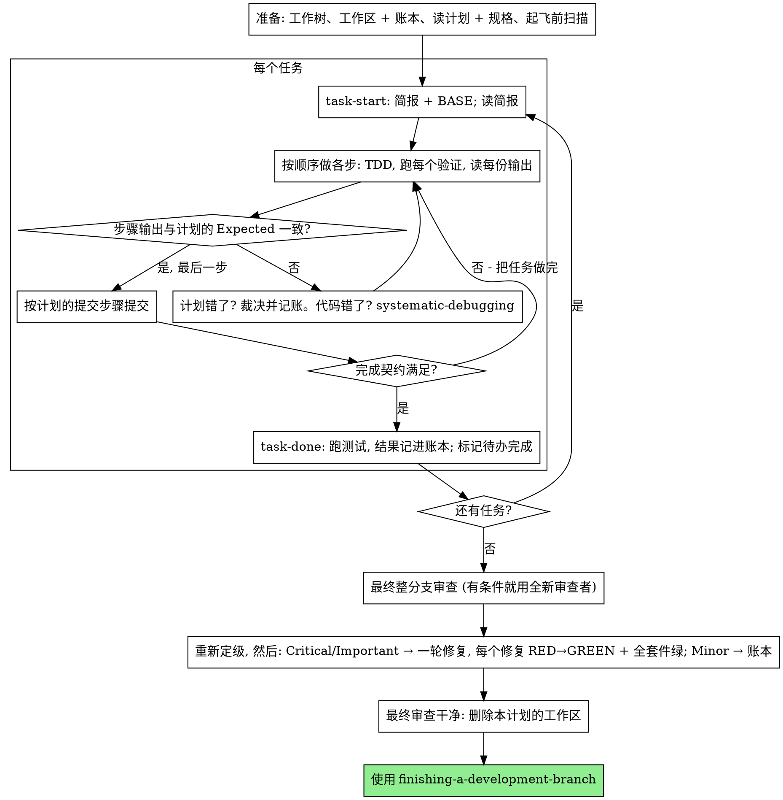

# 执行计划

在本会话里亲自执行计划，一个任务接一个任务：不为每个任务派实现子智能体，也不为每个任务派审查者。只在最后对整个分支做一次全新上下文的审查。

**为什么内联：** 子智能体驱动开发为每个任务付一个全新实现者和一个全新审查者的钱，每一个都要从零重读代码库。内联执行只付一个上下文（你自己的）外加最后一个审查者。它放弃的是每个任务一份全新上下文、每个任务第二双眼睛。本技能用别的办法保住那两样东西换来的好处：简报就是规格，账本就是你的记忆，TDD 是每个任务的关卡，最终审查者就是第二双眼睛。

**核心原则：** 计划已经把该想的都想过了。严格照它执行，每一步都用一个你亲眼看着失败、又亲眼看着通过的测试来证明，并留下一份在你自己遗忘之后依然存在的记录。

**旁白：** 工具调用之间最多说一句简短的旁白——账本和工具结果本身就是记录。

**持续执行：** 不要在任务之间停下来向你的人类伙伴确认。他们选内联执行是为了少花钱，不是为了每做完一个任务就回答一次"我该继续吗？"。不间断地执行计划里的所有任务。

**做裁决，不要停摆。** 冲突、歧义、计划缺陷——你自己定。规格是有约束力的权威，计划是它的论证，两者都答不上来的部分由你的判断来定。每个决定都以 `Ruling: <你决定了什么> — <为什么> — <如果错了代价是什么>` 记进账本，然后继续。没有记进账本的裁决就偏离计划，等于一个暗中做出的决定。

只有四件事会让你停下，也只有这四件：不可逆或破坏性的操作；涉及安全的动作；这个工作树之外、按惯例应当先问一声的副作用（合并、推送到共享分支、发布）；以及一个坏到每条前进路径都只能靠猜的计划。遇到这四类，停下来问。

## 何时使用

- 你有一份来自 writing-plans 的计划，而你的人类伙伴在交接时选择了内联执行。
- 你的运行环境没有子智能体工具（见 `../using-superpowers/references/` 下的各平台参考）。绝不编造一次分派；就在这里执行计划。
- 任务基本相互独立——与 subagent-driven-development 的前提相同。

一份写得完整的计划，会让内联执行变成"照抄 + 测试"：它在中档的会话模型上就能跑得很好，而最强模型唯一值回票价的地方是最终审查——本技能会单独分派它。你的人类伙伴选择内联时，把这一点告诉他们。

当你的人类伙伴希望每个任务都有一道审查关卡，或者计划长到后面的任务会在压缩过的上下文上运行时，优先选 subagent-driven-development。在长计划上内联执行依然可行——账本让它可以恢复——但最后那几个任务分到的是最少的你。

## 流程



## 准备

确保工作发生在一个隔离的工作区里：用 using-git-worktrees 创建一个，或者核实已有的那个。未经你的人类伙伴明确同意，绝不在 main/master 分支上开始实现。

会话记忆无法在上下文压缩（compaction）中存活。一个丢失了位置的内联执行者，会重新实现那些提交早已存在的任务——和控制者重新分派它们是同一种失败，只不过代价付在你自己的上下文里。把进度记在一个账本文件里，而不只是记在待办里。运行环境的待办只是实时视图；账本才是记录。

工作区和账本与 subagent-driven-development 共用——同一个目录、同一种格式——所以一个计划可以在执行中途换执行方式，新的执行者从同一个账本接着做。

- **每个计划拥有自己的工作区：** 技能启动时，运行 `../subagent-driven-development/scripts/sdd-workspace PLAN_FILE`——它会打印这个计划专属的、被 git 忽略的目录（`<repo-root>/.superpowers/sdd/<计划文件名>/`），**本计划**的一切产物都放在那里：账本、简报、审查包。别的计划的目录不属于你，不读也不写。
- 到 `<工作区>/progress.md` 查本计划的账本。如果它的第一行点名的是你的计划文件，那么带有 `Task <N>: complete` 行的任务就是**已完成**——不要重做；从第一个没有该行的任务处继续。即使你的上下文已经不记得做过它们，它们的提交也确实存在于 git 中：压缩之后，相信账本和 `git log`，而不是你自己的记忆。如果账本第一行点名的是另一个计划文件，那是另一个计划的进度：原地别动，另起你自己的新账本。
- 创建账本时，把它的身份写在第一行：`# SDD ledger — plan: <计划文件路径>`。
- `git clean -fdx` 会毁掉工作区（它是被 git 忽略的草稿区）；如果发生了，从 `git log` 恢复。

把计划**读一遍**，记下它的上下文和全局约束，并为每个任务建一条待办。如果计划点名了一份规格（Spec），把规格也读了：规格是计划据以论证的权威，计划内部的冲突要拿它来裁。计划里找不到可达的规格，就在账本里记一条说明——没有规格作出的裁决都是临时的。

**必需子技能：** 现在、在任务 1 之前，加载 test-driven-development。它管着下面每个任务的每一步；一份步骤里已经写着"先写失败的测试"的计划，并不能让你免于读它。

任务 1 之前，扫描计划中任务之间的冲突。计划的 Interfaces 块告诉你该看哪里：每个消费前序任务产出的任务，对应账本里的一行——两个任务、一方产出的东西对照另一方消费的东西、以及你的发现。什么都不共享的任务不占行；任务之间什么都不共享的计划，只记一行 `Pre-flight: no shared interfaces`。以规格为有约束力的权威，对每一行翻出的冲突作出裁决，把裁决记在那一行旁边，然后开始任务 1。每个任务自身的文本在你读它的简报时再检查，不在这里。

## 任务循环

你打印的一切、每一个工具结果，都会在会话剩下的时间里常驻在你的上下文中。把冗长的测试输出重定向到工作区里的文件，只读它的末尾；读简报，而不是整个计划。

### 1. 接下任务

- 运行本技能的 `scripts/task-start PLAN_FILE N`。它一次调用就打印出简报路径和 BASE（这个任务的范围从哪个提交切出）。每个任务都要读简报，包括你在准备阶段就记得的那些：你记得的是摘要，简报里有精确的取值、签名和测试用例。
- 把该任务的待办标为 in_progress。

每一次工具调用都是一轮，要把你的整个上下文重读一遍。记账顺着干活一起做——账本追加和提交放在同一次调用里，绝不单独占一次调用。

### 2. 做各个步骤

计划的步骤已经是 RED-GREEN 的顺序；在准备阶段加载的 test-driven-development 之下，按这个顺序做。测试步骤的代码先写、先跑。看着它失败是一个步骤，不是走过场——一个在实现还不存在时就通过的测试，本身就是一条关于这个测试的发现。

每个会运行命令的步骤都有一行 `Expected:`。运行命令，读它的输出，然后对照。三种结果：

- **一致。** 下一步。
- **代码错了。** 使用 systematic-debugging。找到原因；绝不为了让步骤输出对上而去修补症状。
- **计划错了**——某一步与规格矛盾、前序任务的接口与本任务消费的不一致、一条根本跑不通的命令。对能满足规格的最小改动作出裁决，以 `Task <N>: Ruling: <发现> — <你决定了什么，以及为什么>` 记进账本，然后继续。裁决是被携带的，而不是被记住的：后面碰同一个接口的任务，从账本里读到它。

按计划的提交步骤提交。一个任务跨好几个提交没问题；审查范围从 BASE 切出，绝不用 `HEAD~1`。

### 3. 完成契约

在一个任务写账本行之前，下面各项都必须为真，并且在本会话中有证据——而不是因为 diff 看起来没问题就推断出来：

- 简报点名的每一个测试都存在、都在本任务中跑过，并且你读了输出。
- 本任务最后一次测试运行通过了——`task-done` 就是那次运行，它会把命令和结果写进账本行。
- 简报里的每一行 `Expected:` 都和真实输出对照过。
- 每一处对简报的偏离，在账本里都有一行 `Ruling:`。

**必需子技能：** 这个声明由 verification-before-completion 管辖。任何一项缺失，任务就没有完成：把它做完。

### 4. 完成任务

运行本技能的 `scripts/task-done PLAN_FILE N BASE -- <测试命令>`，测试命令用简报为整个任务点名的那一条。它会跑测试、把完整输出保存在工作区、打印末尾，并且——只有在测试通过时——往账本追加完成行：

`Task <N>: complete (commits <base7>..<head7>, tests: <command> → <result>)`

失败的运行什么都不记录；任务没有完成。记录成功后，把待办标为完成，接下一个任务。

## 最终审查

运行 `../subagent-driven-development/scripts/review-package PLAN_FILE MERGE_BASE HEAD`（MERGE_BASE = 分支起点的那个提交，例如 `git merge-base main HEAD`），并基于它打印出的文件做审查。

**有子智能体工具时：** 在可用的最强模型上分派审查者——整分支审查是一项判断性任务——使用 requesting-code-review 的 [code-reviewer.md](../requesting-code-review/code-reviewer.md)，附上审查包路径、计划和规格的路径、计划的「审查重点（Review Focus）」一节（如果有的话）原文照录（即计划的测试没有覆盖到的输入类别和失败模式——审查者会逐条刻意检查），以及一个指向账本中 `Ruling:` 行的指针，好让它掂量你做过的那些决定。显式指定模型；省略模型会继承会话的模型，而那未必是最强的。这是整次运行唯一买下的全新上下文。不要跳过它，也不要用你自己读一遍 diff 来代替它。

**没有子智能体工具时：** 读 code-reviewer.md，并在最后一个任务的账本行之后，作为单独的一轮，自己对着审查包做那次审查。往账本写 `Final review: self-review (no subagent tool)`，并在你的最终消息里说明：作者自审比全新审查者弱，合并前这是否足够，由你的人类伙伴决定。

在对任何一条发现动手之前，先把它们分拣好。审查者的严重程度标签只是建议；关卡在你手里。它的「不予判断的项」列表（Declined to judge）也归你：那里的每一行都是一个你要作出并记进账本的裁决，和计划冲突一模一样——`Final: Ruling: <审查者搁置的行为> — <使用这个软件的一个合理的人会得到什么，以及为什么维持原样、或为什么现在它算一条发现> — <如果错了代价是什么>`。先按影响重新定级：规格是一份愿景文档，一条发现的级别取决于它上线后使用这个软件的一个合理的人会遭遇什么，而不是规格有没有点名触发它的那个输入——因为规格没提就把发现定为 Minor 的审查者，评的是规格，不是影响。然后：

- **Critical 和 Important** 进入修复轮。
- **Minor** 以 `Final: minor (deferred): <一句话>` 记进账本，并写进你最终消息的"延后的 Minor"一节。Minor 永远不进入修复轮，也永远不会变成裁决——裁决是针对冲突的决定，不是一条"我没采纳这个打磨建议"的备注。

Critical 和 Important 发现由你自己修——在这里你就是实现者——**一轮**修完。每个修复由 TDD 验证，而不是由第二个审查者验证：写出复现该发现的测试，看着它失败，让它通过，然后跑整个套件。每一条都以 `Final: fixed <发现> — <测试名> RED→GREEN, suite <N>/<N>` 记进账本。一个没有先失败过的测试的修复不算验证过；修复轮结束后套件不是全绿，就说明这一轮还没结束。不要分派复审：它要重读的那份 diff，覆盖它的测试已经回答了"是否已解决"，套件运行已经回答了"有没有弄坏别的"。

一条你决定不修的发现，就是一个裁决——`Final: Ruling: <发现> — <为什么代码可以维持原样> — <如果错了代价是什么>`——它会通过裁决清单送到你的人类伙伴面前。没有第二轮修复。

## 收尾

在删除任何东西之前，把账本里所有含 `Ruling:` 的行按你作出它们的顺序收集到最终消息的"我作出的裁决"一节，每条都带上如果错了的代价；把每一行 `minor (deferred)` 收集到"延后的 Minor"一节。两份清单都必须完整。你的最终消息，是你代表你的人类伙伴作出的那些决定——以及你选择不处理的那些发现——送到他们面前的唯一地方。

最终审查干净、它的修复都已提交后，删除本计划的工作区目录——现在 git 历史就是记录。同级目录属于其他计划；别碰它们。

使用 finishing-a-development-branch。

## 常见的合理化借口

| 借口 | 现实 |
|------|------|
| "我记得任务 N 说了什么" | 你记得的是摘要。简报里有精确取值。去读它。 |
| "计划里的代码是对的，跳过看测试失败这一步" | 一个你从没见它失败过的测试什么也证明不了。它就是一步。跑它。 |
| "我最后再跑全套件，不用每一步都跑" | 每步都跑，你才知道是哪一步弄坏的。任务结束时那次运行是契约，不是替代品。 |
| "这里计划错了，我直接做对的就行" | 做对的，并且把裁决记进账本。不记账的偏离是一个暗中做出的决定。 |
| "我做完几个任务再补账本行" | 压缩不会挑一个方便的时机。每个任务一行，和提交在同一条消息里。 |
| "下一个任务之前我先确认一下" | 他们选内联是为了少花钱。进度询问花的是他们的时间。只有那四类情况能让你停下。 |
| "我已经仔细读过自己的 diff，最终审查者是多余的" | 同一个作者，同样的盲区。审查者是这次运行唯一买下的全新上下文。 |
| "改动很小，测试应该能过" | "应该"不是证据。契约要求的是命令和它的输出。 |
| "子智能体又慢又贵，最终审查我也跳过吧" | 内联已经去掉了每个任务的审查者。对整个分支的一次审查是底线，不是上限。 |
| "审查者说是 Minor，那就是 Minor" | 那个标签评的是规格的沉默。评一评使用者会得到什么。先重新定级，再过关卡。 |
| "修复很明显，不需要先写一个失败的测试" | 失败的测试是这条发现真实存在、并且现在已经消失的唯一证明。没有它，你手里只有一份 diff 和一个希望。 |
| "我顺手把 Minor 也修了吧" | 你修的每个 Minor，都是一个你伙伴没要的测试、一次修复、一次套件运行。记进账本；由你伙伴决定。 |

## 示例工作流

```
你：我正在使用 executing-plans 技能以内联方式实现这份计划。

[准备：工作树已核实]
[读计划一次：docs/superpowers/plans/feature-plan.md；规格已读]
[解析工作区：sdd-workspace docs/superpowers/plans/feature-plan.md —— 里面没有账本，全新开始]
[起飞前扫描：2 行共享接口、4 行自洽性，均无问题；已写入账本]
[为所有任务创建待办]

任务 1：钩子安装脚本

[task-start plan 1 → 简报已读；BASE a1b2c3d]
[步骤 1：写失败的测试 —— 已写]
[步骤 2：运行 —— FAIL：install_hook not defined。与 Expected 一致。]
[步骤 3：实现 —— 已写]
[步骤 4：运行 —— PASS 1/1。与 Expected 一致。]
[步骤 5：提交 —— d4e5f6a]
[契约：测试已运行，输出已读，无偏离]
[task-done plan 1 a1b2c3d -- npm test -- hooks → 账本：Task 1: complete (commits a1b2c3d..d4e5f6a, tests: npm test -- hooks → 1/1 pass)]

任务 2：恢复模式

[task-start plan 2 → 简报已读；BASE d4e5f6a]
[步骤 2：运行失败的测试 —— FAIL，但是导入错误：任务 1 导出的是
 installHook，简报消费的是 install_hook]
[裁决：简报里的消费方名称相对于任务 1 的 Produces 块是笔误；
 用 installHook —— 账本：Task 2: Ruling: install_hook → installHook — matches Task 1 Produces — cost if wrong: one rename]
[步骤 2-5 按计划进行；提交 b7c8d9e]
[task-done plan 2 d4e5f6a -- npm test -- recovery → 账本：Task 2: complete (commits d4e5f6a..b7c8d9e, tests: npm test -- recovery → 8/8 pass)]

...

[所有任务之后：review-package plan MERGE_BASE HEAD；分派 code-reviewer，最强模型]
审查者：一条 Important 发现 —— 进度上报间隔被写死了。两条 Minor。
[重新定级：Important 成立；Minor → 作为延后项记进账本]
[修复轮：test_progress_interval_configurable RED → 抽出 PROGRESS_INTERVAL → GREEN；套件 12/12；提交]
[账本：Final: fixed hardcoded interval — test_progress_interval_configurable RED→GREEN, suite 12/12]

我作出的裁决：
- 任务 2：install_hook → installHook（简报笔误；如果错了的代价：一次重命名）

延后的 Minor：
- README 缺少用法示例
- recovery.js 可以把 verify/repair 拆成两个文件

[删除本计划的工作区 —— 记录现在在 git 里]

正在使用 finishing-a-development-branch。
```
